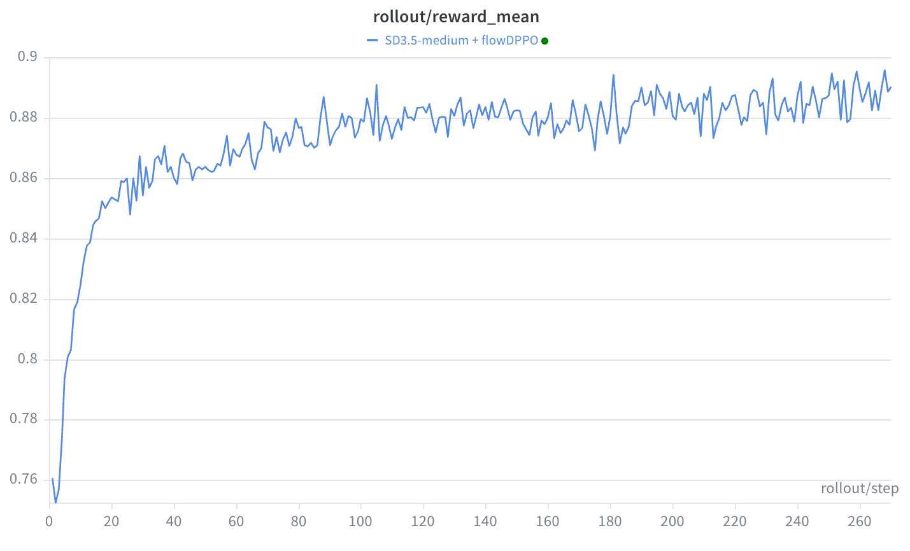

# FlowDPPO — KL-masked diffusion policy optimization

`FlowDPPO` keeps GRPO's setup — the same SDE rollout, the same group-relative
advantage, the same per-step ratio — but **replaces PPO's uniform clipping with a
KL-ADV mask**. It computes the exact Gaussian KL between the old and new SDE transition
policies and zeroes an update only when it *both* diverges far from the old policy *and*
pushes too aggressively in the reward-improving direction.

- **Loss:** [`unirl/algorithms/flowdppo.py`](../unirl/algorithms/flowdppo.py) (`_gaussian_kl_div`, `_flowdppo_kl_adv_loss`, `FlowDPPO`)
- **SDE / replay path:** [`unirl/models/sd3/diffusion.py`](../unirl/models/sd3/diffusion.py), [`unirl/sde/kernels.py`](../unirl/sde/kernels.py)
- **Recipe:** [`examples/diffusion/sd3/sd3_flowdppo.yaml`](../examples/diffusion/sd3/sd3_flowdppo.yaml) · **Config extract:** [`config.yaml`](config.yaml)
- **Checkpoints:**
  - [🤗 Eculid/sd3.5-flowdppo](https://huggingface.co/Eculid/sd3.5-flowdppo) — SD3.5-medium, full weights (community run)
  - [🤗 Tencent-Hunyuan-Multimodal-RL](https://huggingface.co/Tencent-Hunyuan-Multimodal-RL) — official GenEval2 LoRA adapters (single- & multi-reward) on SD3.5-medium and FLUX.2-klein-base-9B
- **Paper:** *"FlowDPPO: Divergence Proximal Policy Optimization for Flow Matching Models."*

FlowDPPO builds on the same GRPO-style SDE rollout, trained-step gating, and
group-relative advantage, then additionally records the per-step Gaussian means.

> Do not confuse this with the robotics algorithm also abbreviated DPPO. Here, FlowDPPO
> is the flow-matching image/video trust-region method in
> [`flowdppo.py`](../unirl/algorithms/flowdppo.py): GRPO replay plus a KL-ADV mask.

## What problem it solves

GRPO-style diffusion RL clips the sampled ratio `ρ`. The FlowDPPO paper argues
that for continuous latent Gaussian policies this ratio is a *noisy single-sample*
proxy for the true policy divergence, so a fixed ratio window over-constrains some
steps and under-constrains others. Flow models offer something better: each SDE step
is an **equal-covariance Gaussian** transition, so the old/new KL is a cheap closed
form — the squared difference of two velocity-network forward passes, no Binary/Top-k
surrogate (the LLM-DPPO needs one; flow models do not).

![FlowDPPO overview: the same GRPO-style SDE rollout — denoise a prompt to an image, score it, and form a group-relative advantage A — then replay each SDE step for the new log-prob and the new Gaussian transition means. The trust region is a two-stage KL-ADV mask: if the per-step KL on the mean shift is small the update always passes (the safe regime runs at full speed); only if the KL is large AND the move is aggressive in the reward direction ((ratio>1 and A>0) or (ratio<1 and A<0)) is the update masked to 0. The loss is mean(-A*ratio*keep_mask), the policy anchor (old log-prob and old means) is frozen across the mini-batches, and the brake is applied only to the large, over-aggressive steps rather than uniformly clipping every step like GRPO.](../assets/flowdppo_overview.png)

## The math

The unmasked term is GRPO's ratio surrogate without the clip:

$$ \rho_{i,k} = \exp\big(\log\pi_\theta(a_{i,k}|s_{i,k}) - \log\pi_{\theta_\text{old}}(a_{i,k}|s_{i,k})\big), \qquad \ell_{i,k} = -A_i\,\rho_{i,k} $$

Both transition policies are Gaussians with the **same variance** `σ_t²` and different
means, so their KL is exact (paper Eq. 14):

$$ D_\text{KL}\big(\pi_{\theta_\text{old}} \,\|\, \pi_\theta\big) = \frac{\lVert \mu_\text{old} - \mu_\theta\rVert_2^2}{2\,\sigma_t^2} $$

The repo uses the same equal-covariance KL but **reduces over latent dims with a mean**,
so the logged `kl_score` is the paper's KL divided by the latent dimensionality:

$$ \mathrm{kl\_score}_{i,k} = \mathrm{mean}_{C,H,W}\!\left[\frac{(\mu_{\theta} - \mu_\text{old})^2}{2\,\sigma_t^2}\right] $$

This matters for tuning: `kl_mask_threshold` is calibrated against a **mean-reduced**
score, not the full-norm sum. A step is dropped only when *both* hold — the KL is high
**and** the move is over-aggressive (paper Eq. 18):

$$ \text{drop} = (\mathrm{kl\_score} \ge \tau)\ \wedge\ \big[(\rho>1 \wedge A>0)\ \vee\ (\rho<1 \wedge A<0)\big] $$

$$ \mathcal{L} = \mathbb{E}_{i,k}\big[\, \ell_{i,k}\cdot\mathbb{1}[\neg\,\text{drop}]\,\big] $$

The code in `_flowdppo_kl_adv_loss` follows this directly:

```python
ratio = torch.exp(new_logp - old_logp)
kl = ((new_means - old_means) ** 2 / (2 * sigma_t ** 2)).mean(dim=latent_dims)  # per sample
keep   = kl < kl_mask_threshold                  # low divergence → always keep
pos_rm = (~keep) & (ratio > 1) & (adv > 0)       # high-KL, over-pushing a good sample
neg_rm = (~keep) & (ratio < 1) & (adv < 0)       # high-KL, over-suppressing a bad sample
loss = torch.where(~(pos_rm | neg_rm), -adv * ratio, 0.0).mean()
```

Low-KL steps always pass. A high-KL step also passes when it is **corrective** — e.g.
`A > 0` but `ρ < 1` — because the gradient is moving probability back toward the old
policy. Like the GRPO-style diffusion recipes, the recipe sets
`adv_use_global_std: true` (per-group mean, one batch-wide std).

## Math → code map

| Math object | Repo object |
|---|---|
| State `s_k = (c, t_k, x_{t_k})` | `track.conditions` + `segment.latents_at(step_idx)` |
| Action `a_k = x_{t_{k+1}}` | `segment.latents_at(step_idx + 1)` |
| Old transition log-prob | `segment.sde_logp` → `old_logp` |
| New transition log-prob | `stage.replay(...).log_probs` → `new_logp` |
| Old Gaussian mean `µ_old` | `segment.sde_means`, populated by `prepare_segment` |
| New Gaussian mean `µ_θ` | `stage.replay(...).prev_sample_means` → `new_means` |
| Gaussian scale `σ_t` | `FlowDPPO._compute_sigma_t` (from `segment.sigmas`, `dt`, `params.eta`) |
| KL threshold `τ` (paper `δ`) | `algorithm.kl_mask_threshold` |
| Advantage `A_i` | `track.advantages`, broadcast to `[B, S]` |
| Masked objective | `_flowdppo_kl_adv_loss` |

## From rollout to update

The rollout follows the same GRPO-style SDE path, plus the per-step Gaussian means:

1. Selected SDE steps produce `LatentSegment.latents`, `sigmas`, `sde_indices`, and
   (in rollout mode) `sde_logp`.
2. `RewardService` scores the decoded images, then
   `RolloutTrack.compute_advantages(normalize=True, use_global_std=True)` writes
   prompt-centered, batch-std advantages.
3. `TrainStack.train_track` calls `FlowDPPO.prepare_segment` once: a `no_grad`
   replay at pre-update weights that keeps `sde_logp` if present, fills it if missing,
   and **always** writes `segment.sde_means`.
4. Each micro-batch calls `compute_loss_and_backward`: replay at current weights for
   `new_logp` + `new_means`, gather the frozen old fields, compute `sigma_t`, apply the
   KL-ADV mask, and `backward()`.

The old anchor is therefore two-part, both frozen before the
`stack.num_updates_per_batch` mini-batches so every step compares against the same
pre-update policy:

| Anchor | Why it matters |
|---|---|
| `old_logp` | the sampled ratio `ρ` |
| `old_means` | the exact equal-covariance Gaussian KL |

## Sigma normalization

With `add_kl_coefficient: true`, `_compute_sigma_t` mirrors the Flow-SDE transition
scale (`FlowSDEStrategy`):

$$ \sigma_t = \sqrt{\tfrac{s_k}{1-s_k}}\;\eta\;\sqrt{-(s_{k+1}-s_k)} $$

With `add_kl_coefficient: false` it returns ones, and the mask uses the raw squared
mean-difference / 2. The canonical recipe keeps it `true`.

## Key knobs ([`config.yaml`](config.yaml))

| Knob | Meaning |
|---|---|
| `kl_mask_threshold` | `τ`. Mean-reduced per-sample KL below this passes freely; above it the advantage-aware mask applies. Default `1e-5`. |
| `add_kl_coefficient` | `true` ⇒ normalize the mean-shift by σ_t (the exact KL); `false` ⇒ raw mean-difference² / 2. |
| `sampling.eta` | SDE stochasticity (needed for log-probs and the means); same as the GRPO-style SDE rollout. |
| `sampling.scheduler.num_sde_steps` | Steps that record log-probs + means (the trained steps). |
| `stack.num_updates_per_batch` | Supported because both `old_logp` and `old_means` are frozen in `prepare_segment`. |
| `adv_use_global_std` (top-level) | `true`: per-group mean, one batch-wide std. |

## Debug checklist

| Symptom | First files / variables to check |
|---|---|
| Almost every update masked | `masked_fraction`, `kl_mask_fraction`, `kl_new_old_mean` — lower LR or raise `kl_mask_threshold` |
| `RuntimeError` about missing means | `stage.replay(...).prev_sample_means`; `SD3DiffusionStage.replay`; the SDE strategy must return means |
| KL score wrong after a scheduler change | `segment.sigmas`, `params.eta`, `_compute_sigma_t`, `add_kl_coefficient` (mean-reduced score!) |
| `ratio_mean` not ≈ 1 on update #1 | `old_logp` / `new_logp` source, rollout↔train sync, `prepare_segment` timing |
| No trained steps | `segment.sde_indices`, `num_sde_steps`, `sampling.eta` |

Metric source: `masked_fraction`, `kl_mask_fraction`, `kl_new_old_mean/max`, and the
`ratio_*` values are all emitted by `_flowdppo_kl_adv_loss`.

## Run it

```bash
PRETRAINED_MODEL=stabilityai/stable-diffusion-3.5-medium \
python -m unirl.train_diffusion --config-name=diffusion/sd3/sd3_flowdppo num_devices=8
```



A healthy run climbs `rollout/reward_mean` quickly and then keeps inching up — the
curve above is the **SD3.5-medium** run, going from ~0.75 to ~0.89 over ~270 steps.

## Related tutorial

- **[DRPO](../DRPO/)** is the AR analogue of divergence masking, but token distributions
  require a Binary-TV/KL approximation; flow models get equal-covariance Gaussian KL
  directly from the transition means.

## References

- FlowDPPO — the exact equal-covariance Gaussian KL is its Eq. 14, the asymmetric
  mask its Eq. 18.
- DPPO (the LLM ancestor of the divergence mask): Qi et al., *"Rethinking the Trust
  Region in LLM Reinforcement Learning"* — [arXiv:2602.04879](https://arxiv.org/abs/2602.04879).
- FlowGRPO (the SDE rollout FlowDPPO reuses): [arXiv:2505.05470](https://arxiv.org/abs/2505.05470).
