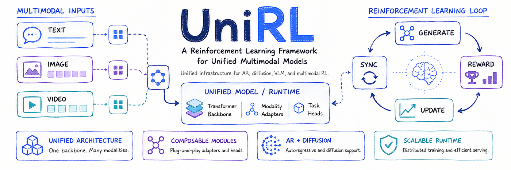
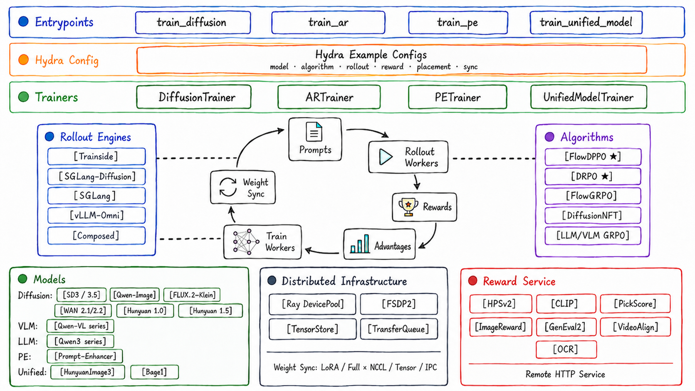

<div align="center">



### A Reinforcement Learning Framework for Unified Multimodal Models

**U**(you)·**ni**(need)·**RL** for unified multimodal intelligence

[](pyproject.toml)
[](LICENSE)
[](https://unirl-project.github.io/unirl/)
[](https://unirl-project.github.io/unirl/community/wechat-qr.jpg)

</div>

## News 🚀

- **[2026-06]** **DRPO** released — *"Rethinking the Divergence Regularization in LLM RL"* ([arXiv](https://arxiv.org/abs/2606.09821)).
- **[2026-06]** **Flow-DPPO** released — *"FlowDPPO: Divergence Proximal Policy Optimization for Flow Matching Models"* ([arXiv](https://arxiv.org/abs/2606.11025)).
- **[2026-06]** **CPPO** released — *"Beyond Uniform Token-Level Trust Region in LLM Reinforcement Learning"* ([arXiv](https://arxiv.org/abs/2606.10968)).

## About 💡

UniRL applies one RL post-training loop — generate samples, score them, compute
advantages, update the policy, and sync weights back to rollout workers —
across multimodal model families.

<div align="center">
  
</div>

UniRL is a layered, composable system. Each **entrypoint** (`train_diffusion`,
`train_ar`, `train_pe`, `train_unified_model`) loads a **Hydra example config**
covering model, algorithm, rollout, reward, placement, and sync, then creates the
matching domain **trainer** (`DiffusionTrainer`, `ARTrainer`, `PETrainer`,
`UnifiedModelTrainer`). The trainer coordinates the RL loop across pluggable
**rollout engines**, **algorithms**, **model bundles**, **reward services**, and
the shared **distributed runtime**: Ray `DevicePool`, FSDP, Transfer
Queue (TQ), and LoRA/full-weight sync. See [`unirl/README.md`](unirl/README.md) for the
runtime loop, deployment modes, and module map.

## Team-Proposed Algorithms 🌟

> **🌟 These algorithms are proposed by our team — the highlight of UniRL.** Each
> algorithm's folder holds a step-by-step tutorial and a runnable example recipe.
> We highly recommend trying them in our framework!

| Algorithm | Paper | Tutorial | Notes |
|---|---|---|---|
| **Flow-DPPO** | [*"Flow-DPPO: Divergence Proximal Policy Optimization for Flow Matching Models"*](https://arxiv.org/abs/2606.11025) | [FlowDPPO/](FlowDPPO/) | Diffusion/flow RL with an exact divergence-based trust-region mask. |
| **DRPO** | [*"Rethinking the Divergence Regularization in LLM RL"*](https://arxiv.org/abs/2606.09821) | [DRPO/](DRPO/) | Token-level LLM RL with a smooth advantage-weighted quadratic regularizer. |
| **CPPO** | [*"Beyond Uniform Token-Level Trust Region in LLM Reinforcement Learning"*](https://arxiv.org/abs/2606.10968) | [CPPO/](CPPO/) | Token-level LLM RL with a position-weighted, cumulative-prefix-budget Binary-TV mask. |

UniRL also wires in standard reference algorithms — **(LLM's)GRPO**, **DiffusionNFT**,
**DanceGRPO**, and **MixGRPO** — in [`unirl/algorithms/`](unirl/algorithms/README.md).

## Model Support 🎨

Model and algorithm support are **two independent dimensions** that compose within
a domain: any diffusion algorithm (see above) runs on a diffusion
model, AR algorithms on AR models — so UniRL covers many more model × algorithm
combinations than the shipped example recipes alone. The table below is the model
dimension; all listed models are supported (✅).

<div align="center">

| Model | Category | Modality | Status |
|---|---|---|---|
| Stable Diffusion 3 / 3.5 | Image diffusion | Text → Image | ✅ |
| Qwen-Image | Image diffusion | Text → Image | ✅ |
| FLUX.2-Klein | Image diffusion | Text → Image / Text + Image → Image | ✅ |
| Z-Image | Image diffusion | Text → Image | ✅ |
| WAN 2.1 | Video diffusion | Text / Image → Video | ✅ |
| WAN 2.2 | Video diffusion | Text / Image → Video | ✅ |
| HunyuanVideo 1.0 / 1.5 | Video diffusion | Text → Video | ✅ |
| Qwen-VL | Vision-language AR | Text + Image → Text | ✅ |
| Qwen3 | LLM AR | Text → Text | ✅ |
| Prompt-Enhancer | LLM + diffusion | Text → Text → Image | ✅ |
| HunyuanImage3 | Unified AR + diffusion | Text → Image | ✅ |
| Bagel | Unified AR + diffusion | Text → Image | ✅ |

</div>

Each model maps to a domain entrypoint (`train_diffusion`, `train_ar`, `train_pe`,
`train_unified_model`); see **Getting Started** below to run any of them.

## Training Modes 🧩

UniRL unifies four training modes, one Hydra example bucket and entrypoint each.
Examples are self-contained YAML files selected with
`--config-name=<domain>/<example>`:

| Domain | Trains | Entrypoint | Example |
|---|---|---|---|
| `diffusion/` | Image / video diffusion models | `train_diffusion` | `diffusion/sd3/sd3_sglang_rollout_colocate` |
| `ar/` | Autoregressive models — vision-language (VLM) + text-only (LLM) | `train_ar` | `ar/qwen_vl_grpo_geo3k_mc_4x8`, `ar/qwen3_drpo_4b_base_dapo_sglang` |
| `pe/` | Prompt-enhancer (AR rewriter + diffusion reward) | `train_pe` | `pe/pe_sglang_full_pickscore` |
| `unified_model/` | Unified AR + diffusion models | `train_unified_model` | `unified_model/hi3_vllmomni` |

See [`examples/README.md`](examples/README.md) for the full launch guide, naming
schema, and how to add a recipe.

## Getting Started ⚡

Install dependencies first — see [INSTALL.md](INSTALL.md).

```bash
# compose-check, then launch a single-node example
python -m unirl.train_diffusion --config-name=diffusion/sd3/sd3_trainside --cfg job --resolve
bash examples/run_experiment_single_node.sh diffusion/sd3/sd3_trainside
```

Full [launch guide](examples/README.md#running-a-recipe) — multi-node, every entrypoint, mooncake.

## Roadmap 🗺️

We are actively expanding model and algorithm coverage. Near-term directions:

- Broaden algorithm coverage for the newer model families — FLUX.2-Klein,
  HunyuanVideo 1.0 / 1.5, and Bagel.
- Extend the team-proposed algorithms (Flow-DPPO, DRPO) to more model families.
- Broaden reward backends and rollout-engine coverage across domains.

Want a model or algorithm prioritized? [Open an issue](https://github.com/Tencent-Hunyuan/UniRL/issues) to discuss.

## Contributing 🤝

Contributions and questions are welcome. Before opening a pull request, read the
repository conventions in [`AGENTS.md`](AGENTS.md), run the
[pre-PR checks](examples/README.md#adding-or-editing-a-recipe) for the files you
touched, and fill in the [pull request template](.github/pull_request_template.md).
For questions, bug reports, and feature requests,
[open an issue](https://github.com/Tencent-Hunyuan/UniRL/issues).

## Acknowledgement 🙏

UniRL builds on ideas and infrastructure from the open-source RL and inference
ecosystem. We especially thank
[vLLM](https://github.com/vllm-project/vllm),
[SGLang](https://github.com/sgl-project/sglang),
[slime](https://github.com/THUDM/slime), and
[verl](https://github.com/volcengine/verl).

## Citation 📚

If you find UniRL helpful, please cite:

```bibtex
@misc{unirl_github,
  title        = {{UniRL: A Reinforcement Learning Framework for Unified Multimodal Models}},
  author       = {Haonan Wang and Linyu Wu and Qian Qiu and Lewei Jin and Bowen Ping and Jianghai Chen and Yiheng Du and Guangxin He and Yu Shi and Yongguang Lin and Zhuoxin Zhou and Zhanchao Zhou and Keming Wu and Rizhen Hu and Xuefei Ning and Lvfang Tao and Feiyu Hu and Xiangyan Liu and Siqi Kou and Jiarui Yao and Xiangxin Zhou and Liefeng Bo and Wenxi Zhu and Tianyu Pang},
  year         = {2026},
  howpublished = {\url{https://github.com/Tencent-Hunyuan/UniRL}},
  urldate      = {2026-06-05}
}
```

If you use DRPO, please also cite:

```bibtex
@misc{yao2026drpo,
  title         = {{Rethinking the Divergence Regularization in LLM RL}},
  author        = {Jiarui Yao and Xiangxin Zhou and Penghui Qi and Wee Sun Lee and Liefeng Bo and Tianyu Pang},
  year          = {2026},
  eprint        = {2606.09821},
  archivePrefix = {arXiv},
  primaryClass  = {cs.LG},
  url           = {https://arxiv.org/abs/2606.09821}
}
```

If you use Flow-DPPO, please also cite:

```bibtex
@misc{ping2026flowdppo,
  title         = {{Flow-DPPO: Divergence Proximal Policy Optimization for Flow Matching Models}},
  author        = {Bowen Ping and Xiangxin Zhou and Penghui Qi and Minnan Luo and Liefeng Bo and Tianyu Pang},
  year          = {2026},
  eprint        = {2606.11025},
  archivePrefix = {arXiv},
  primaryClass  = {cs.LG},
  url           = {https://arxiv.org/abs/2606.11025}
}
```
