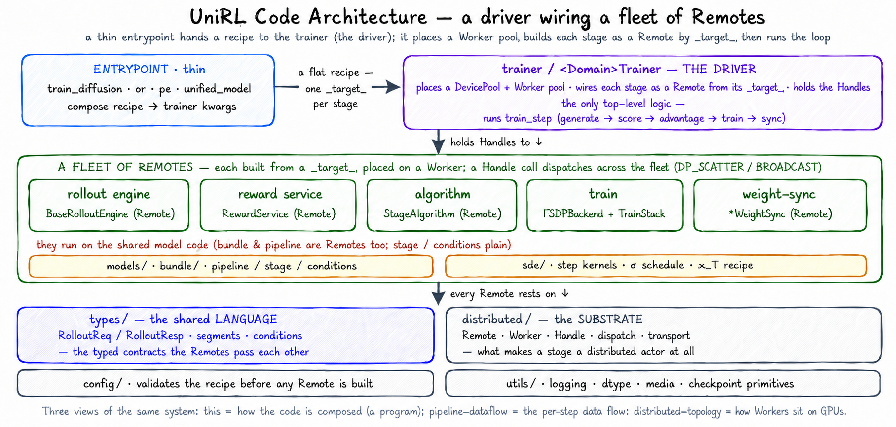
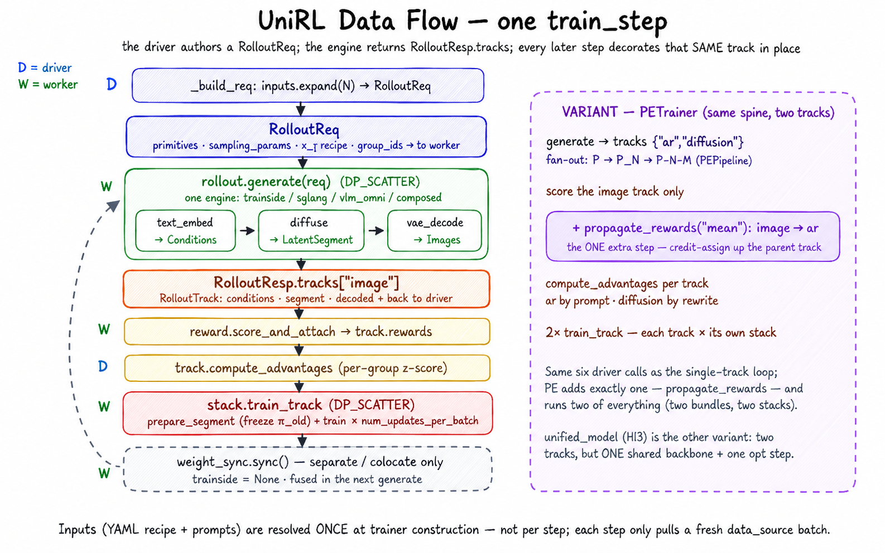

# Code Architecture

`unirl/` is the framework package — the layered, composable core that turns one
Hydra recipe into a multi-GPU RL training run. This README is the **map of the
source tree**: what the layers are, how they depend on each other, and which
module README to read next. (For *what* UniRL is and how to launch it, see the
[top-level README](../README.md); for *how tensors move across GPUs at runtime*,
see [`distributed/README.md`](distributed/README.md).)

  

UniRL is a thin entrypoint that hands a recipe to the trainer (the **driver**),
which places a Worker pool and wires each stage as a `Remote` from the recipe's
`_target_` — not by import. As source, the package falls into four groups:

- **Entrypoints** (`train_diffusion.py`, `train_ar.py`, `train_pe.py`,
  `train_unified_model.py`) — one per domain. Each composes and validates the Hydra
  recipe, then hands off to its trainer.
- **Orchestration** (`trainer/`) — the per-domain `<Domain>Trainer` owns GPU
  placement, builds the rollout and train workers, and runs the
  rollout→reward→advantage→train loop.
- **Training loop** (`rollout/`, `reward/`, `algorithms/`, `train/`) — the four
  pluggable stages of one rollout, plus the components they share: `models/`
  (per-model bundles), `sde/` (step kernels / σ schedule), and `data/` (sources).
- **Foundation** (`distributed/`, `config/`, `types/`, `utils/`) — the
  cross-cutting infrastructure every layer rests on: the Ray
  worker/dispatch/transport runtime, config build-and-validate, the shared typed
  contracts, and helpers.

## Module Map

| Path | Responsibility |
|---|---|
| `train_diffusion.py`, `train_ar.py`, `train_pe.py`, `train_unified_model.py` | Per-domain Hydra entrypoints |
| `trainer/` | Per-domain training lifecycle (`base.py` + `diffusion`/`ar`/`pe`/`unified_model`): owns placement, builds workers, and runs the rollout→reward→advantage→train loop |
| `config/` | `require` + `validate_*` cross-component validators over the flat Hydra recipe (instantiation itself is `_target_`-driven, not in this module) |
| `distributed/` | Ray worker base (`Remote`) + placement/dispatch (`group/`), tensor transport (`tensor/`), and weight sync (`weight_sync/`) |
| `rollout/` | Rollout engine contracts and implementations (`engine/`: trainside, sglang, sglang_llm, vllm_omni, composed) |
| `train/` | Train stack: `TrainStack`, FSDP backend, LoRA/DiffusionNFT/mirror injection, EMA shadow, optimizer/lr |
| `algorithms/` | Per-track loss algorithms (GRPO, DiffusionNFT, FlowDPPO, DRPO) |
| `models/` | Per-model bundles, pipelines, stages, conditions; text/vision/vae helpers |
| `reward/` | `RewardService` holding one backend — local scorers or the remote HTTP client |
| `sde/` | SDE step kernels, σ schedule/shift, initial-noise generation (the `NoiseRecipe` contract lives in `types/`) |
| `types/` | Shared typed contracts: `RolloutReq` / `RolloutResp`, conditions, segments, rewards, sampling |
| `data/` | Data source and dataset readers |
| `utils/` | Logging, dtype, media, timing, checkpoint, and misc helpers |

## Deployment modes

The rollout engine and optional `sync:` section define how GPUs are used:

| Mode | Layout | Sync |
|---|---|---|
| Train-side sampling | Training workers generate samples directly | Not used |
| Separate rollout | Rollout and training use different GPU pools | Required |
| Colocated rollout | Rollout and training share GPU bundles with offload/onload | Required |

See [`distributed/README.md`](distributed/README.md) for how each mode places
workers and moves rollout data between them.

## Runtime Data Flow

The layers above turn one recipe into a repeating loop. A single training step
flows through them like this:

  

1. An entrypoint composes the chosen `examples/<domain>/<recipe>.yaml` and runs validators.
2. The `<Domain>Trainer` (e.g. `trainer/diffusion.py`) acquires a Ray `DevicePool` and builds the rollout and train workers.
3. The trainer builds a typed `RolloutReq` and dispatches it to the rollout engine.
4. The engine returns a `RolloutResp`, whose `tracks[name]` carry conditions, segments, rewards, and media previews.
5. `RewardService.score_and_attach` attaches rewards; `RolloutTrack.compute_advantages` z-scores them into advantages.
6. `TrainStack.train_track(...)` shards the track across train workers and runs the mini-batch optimizer loop.
7. Each train worker owns a model `Bundle`, an `FSDPBackend`, and one loss algorithm.
8. Dedicated-rollout modes (separate / colocate) sync trainer weights back to the rollout workers.

## Deeper Module Docs

- `trainer/README.md`: the orchestration hub — how a `<Domain>Trainer` places workers and drives the loop.
- `config/README.md`: flat-recipe config — `require`/precision validators, `_target_` instantiation, cross-component contracts.
- `rollout/README.md`: rollout modes, engines, request/response flow.
- `train/readme.md`: train stack, FSDP backend, injection, EMA shadow.
- `algorithms/README.md`: per-track loss algorithms.
- `reward/README.md`: reward backends and custom scorers.
- `models/README.md`: model bundle and per-model package contracts.
- `sde/README.md`: SDE kernels, σ schedule, initial noise.
- `distributed/README.md`: distributed runtime — workers, dispatch, placement, and the rollout→train data plane.
- `distributed/weight_sync/README.md`: trainer→rollout weight-sync backends.
