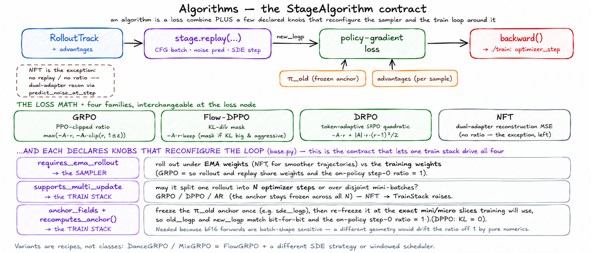

# Algorithms

> **Where it fits:** the loss half of the *train* step —
> rollout → reward → advantage → **train** → sync. In: a track with advantages.
> Out: gradients on the model (the optimizer step in `../train` consumes them).
> Full map: [`../README.md`](../README.md).

  

*A `StageAlgorithm` is two things: a **loss combine** (`stage.replay → new_logp`, mixed with the frozen **π_old** anchor and advantages — four interchangeable families) and a few **declared knobs** (`requires_ema_rollout`, `supports_multi_update`, `anchor_fields`/`recomputes_anchor()`) that reconfigure the sampler and the train loop around it.*

## What it is

`unirl.algorithms` is the train-side loss half of the framework. Each algorithm is
a `StageAlgorithm` that takes a rollout track with advantages already attached,
replays the stage at the current weights, computes a policy-gradient loss, and
calls `backward()`. It owns the loss math and nothing else — no optimizer, no
model, no data.

## Why it exists

The four objectives need *different things from the rest of the train step*, and
`StageAlgorithm` is where that divergence is declared without forking the trainer.
Two class attributes drive the surrounding machinery: `requires_ema_rollout` tells
the sampler whether to roll out under EMA weights (DiffusionNFT sets it `True`; GRPO keeps it
`False` so rollout and replay share weights and the step-1 ratio is exactly 1), and
`supports_multi_update` tells `TrainStack` whether one rollout may be split into N
optimizer steps (it *raises* if a `False` algorithm meets `num_updates_per_batch > 1`).
The π_old anchor geometry is *not* centralized here — the algorithm only declares
`anchor_fields` / `recomputes_anchor()`; `TrainStack` does the per-slice recompute.
So this module keeps four rollout/update **contracts** selectable at the loss node,
not just three-tensor arithmetic.

## How it works

- **The loop.** The trainer builds one algorithm per track and hands it to a
  `TrainStack`. Per rollout the stack runs `prepare_segment` once (freeze the π_old
  anchor), then `num_updates_per_batch` optimizer steps over disjoint mini-batches,
  each a micro-batch loop of `compute_loss_and_backward`.
- **`compute_loss_and_backward` is pure ratio/quadratic math.** It delegates the
  whole forward — CFG batching, noise prediction, SDE stepping — to
  `stage.replay(...)` and gets back `new_logp` (DiffusionNFT is the exception: it runs its own
  dual-adapter loop via `predict_noise_at_step`). The families: GRPO is a
  PPO-clipped ratio (`flowgrpo.py` / `grpo.py`); FlowDPPO masks `-A·r` by a
  Gaussian-KL-vs-advantage criterion (`flowdppo.py`); DiffusionNFT is a dual-adapter
  reconstruction MSE (`diffusionnft.py`); DRPO is a token-adaptive SPO quadratic (`drpo.py`).
- **The anchor contract — the subtle part.** bf16 forwards are batch-shape
  sensitive, so a π_old anchor computed at a different geometry than `new_logp`
  drifts the on-policy ratio off 1 (and FlowDPPO's KL off 0). Algorithms just declare
  `anchor_fields` (which segment fields to freeze) and `recomputes_anchor()`
  (whether `prepare_segment` replays); `TrainStack` then recomputes the anchor over
  the *exact same* mini/micro slices it will train on. No hardcoded field names.
- **Variants are recipes, not classes.** DanceGRPO and MixGRPO are `FlowGRPO`
  with a different SDE strategy or a windowed index scheduler. Add a class only when
  the loss math itself changes.

**Extending it:** a new diffusion loss subclasses `StageAlgorithm`, calls
`stage.replay(...)`, computes a per-element loss, and `(loss * loss_scale).backward()`;
if it needs multi-update, set `anchor_fields` and `supports_multi_update = True` and
mirror `FlowGRPO`. A new AR loss mirrors `GRPO` (early-return on an empty
segment, expand advantages per token), keeping `supports_multi_update = False`.

## Gotchas

- **`old_logp_source: rollout` with a replay-only engine** — a separate-worker
  SGLang rollout emits no per-step `sde_logp`, so the `rollout` source raises in
  `prepare_segment`. Use `replay` (the cost is one extra `torch.no_grad` replay).
- **`num_updates_per_batch > 1` on DiffusionNFT** raises in `TrainStack.__init__` — DiffusionNFT keeps
  the default `supports_multi_update = False`. The four that allow it all freeze a
  stable anchor: `FlowGRPO`/`FlowDPPO` freeze `sde_logp` once in
  `prepare_segment`, while `GRPO`/`DRPO` reuse the rollout log-prob as the anchor
  for all N steps (verl `bypass_mode` parity — so the AR ratio also carries the
  rollout-vs-train engine gap, by design).
- **FlowDPPO isn't fully on-policy under `rollout`** — it always replays `sde_means`
  (KL = 0) but keeps the engine's `sde_logp`, so its ratio isn't pinned to 1. Use
  `replay` to also pin the ratio.
- **`params` must reuse the rollout `guidance_scale`/`eta`/`shift`** — single-track
  recipes bind `params: ${sampling}`; composed recipes bind the sub-block (e.g.
  `${sampling.diffusion}`). A mismatch silently skews log-probs.
- **AR `sampling_temperature` must equal the rollout `sampling.temperature`** —
  `ARStage.replay` rescales logits by it (`log_softmax(logits / T)`) to match SGLang's
  distribution; when unset it silently falls back to the `ARSamplingParams` default,
  *not* the engine's actual temperature, biasing every ratio with no raise. Watch
  `rollout_replay_logp_absdiff_mean` — it should be ~0 on an on-policy step.
