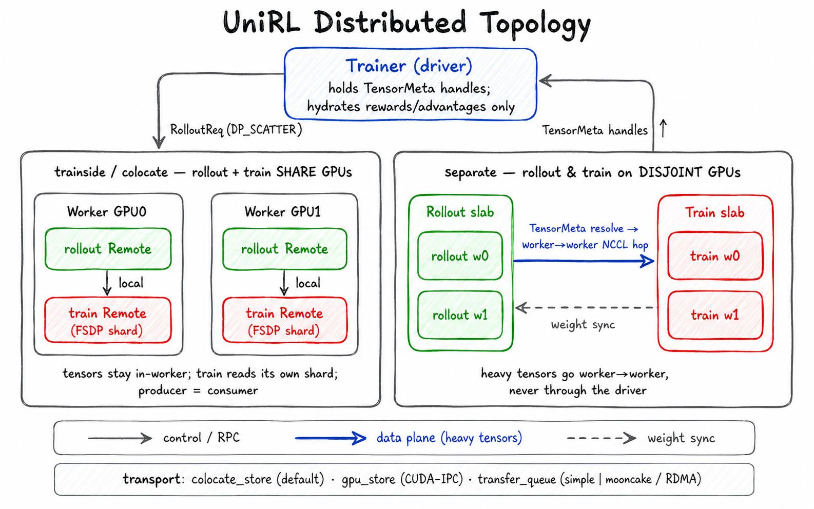

# Distributed Runtime

> **Where it fits:** the fabric under the whole loop — it places the rollout and
> train workers on GPUs, fans every `RolloutReq` / `train_track` / `sync` call out
> to them, and moves rollout data between them without routing the heavy tensors
> through the driver. Full map: [`../README.md`](../README.md).

  

*The data plane is a handle proxy: a produced tensor is **dehydrated** into a `TensorMeta` (the bytes stay on the worker); the driver shuffles handles and **hydrates** only the small rewards/advantages; **`localize`** then resolves each handle on its consumer — a local read if the home worker is the consumer, or one worker→worker NCCL hop if not.*

## What it is

`unirl.distributed` is the runtime that turns single-process trainer code into a
multi-GPU, multi-node program. Three parts:

- **`group/`** — the worker model. Your logical worker code is a `Remote`; it runs
  inside a `Worker` (one Ray actor per GPU). A driver-side `Handle` makes one method
  call fan out across workers by a declared *dispatch mode*. `DevicePool` /
  `placement` carve the GPUs into slabs.
- **`tensor/`** — the data plane. How tensors move (or stay put) between workers,
  via a `TensorMeta` proxy layer over a pluggable transport.
- **`weight_sync/`** — the trainer→rollout back-edge ([its own README](weight_sync/README.md)).

## Why it exists

RL training is several programs at once — samplers, scorers, optimizers — spread
over many GPUs and nodes, passing big tensors around. Hand-writing that (Ray actors,
placement groups, NCCL groups, who-owns-which-tensor) in every trainer would be
unmaintainable. This layer hides it behind two ideas:

- **Call a method, it runs everywhere it should.** The trainer writes
  `self.rollout.generate(req)`; because `generate` is tagged
  `@distributed(DP_SCATTER)`, the framework shards `req` across the rollout workers,
  runs it, and merges the result. The trainer reads like single-process code.
- **The driver never holds the heavy bytes.** A rollout can be hundreds of GB of
  latents. Gathering it to the driver to hand to the trainer would OOM. So a produced
  tensor stays resident on its worker; the driver passes around only lightweight
  `TensorMeta` handles.

## How it works

- **Workers & Remotes.** A `Worker` (`group/worker.py`) is one Ray actor per GPU,
  hosting a dict of named `Remote`s (`group/remote.py`) — rollout engine, bundle,
  FSDP backend, algorithm, stack — as colocated siblings that resolve each other by
  name. You never call a worker directly: a driver-side `Handle` (`group/handle.py`)
  binds each `@distributed` method and turns one call into per-worker Ray RPCs.
- **Dispatch modes** (`group/dispatch.py`) decide how a call fans out; `DP_SCATTER`
  is the default and the workhorse:
  - `BROADCAST` — same args to every worker (e.g. `wake_up`).
  - `SCATTER` — one shard per worker across the whole world.
  - `DP_SCATTER` — split into `dp_size` shards, DP-group peers get the same shard,
    results merged back (`pytree_cat`). This is how `generate` and `train_track`
    shard a batch.
  - `DP_SCATTER_HEAD` — same, but only the DP head receives the shard (saves RPC
    bandwidth).
- **Placement** (`group/device_pool.py`, `group/placement.py`). A `DevicePool`
  reserves one Ray placement group per node (one GPU per "bundle"). A `placement(…)`
  scope claims a slab of devices and builds the workers in it — pure data-parallel by
  default (`rank == dp_rank`); any TP/FSDP sharding is set up inside each role's
  `initialize()`.
- **The data plane — how rollout data reaches train** (`tensor/`). The subtle part,
  and the one most worth understanding:
  1. `generate` runs `DP_SCATTER` on the rollout workers. As each worker returns,
     every tensor in the `RolloutResp` is **dehydrated** into that worker's store and
     replaced by a `TensorMeta` (a ref + shape).
  2. The driver's merge concatenates **handles**, so the heavy bytes never leave the
     workers; the driver hydrates only the small `rewards`/`advantages` vectors it
     needs to score and compute advantages.
  3. `train_track` runs `DP_SCATTER` again, re-partitioning those refs across the
     **train** workers. Each train worker resolves its `TensorMeta`s to real tensors
     through the **transport** — and that resolve is where the layout shows up.
- **Transport** (`tensor/backend/`, picked cluster-wide by `transport_kind`):
  `colocate_store` (default — tensors live in the producing worker's process,
  cross-GPU resolves over NCCL), `gpu_store` (per-GPU CUDA-IPC, for multi-slot
  colocate), or `transfer_queue` (a global bus — `simple` in-memory for zero-infra,
  `mooncake` RDMA for production).
- **Layouts** decide whether rollout and train share GPUs, and therefore what a
  resolve costs:
  - **trainside / colocate** — rollout reuses the train model on the **same**
    workers, so a train worker's ref already points at its own store → a local read,
    nothing crosses.
  - **separate** — rollout on a disjoint GPU slab; resolving a foreign ref fires a
    **direct worker→worker NCCL hop** (rollout slab → train slab), never via the
    driver. (SGLang returns inputs on CPU via Ray IPC, moved to GPU on the train
    worker.)

**Extending it:** a new dispatch mode is an enum entry + a `(dispatch, collect)` pair
in `group/dispatch.py`; a new transport is a backend under `tensor/backend/`
implementing the transport ABC and wired into the `build_transport()` kind-dispatch in `tensor/factory.py`; a new physical
layout is a `placement(…)` wiring in the trainer (`trainer/diffusion.py`).

## Gotchas

- **The driver holds proxies, not tensors.** Driver-side arithmetic on a
  `RolloutResp` / track field must `_hydrate_tensor_meta` first (the trainer does this
  for `rewards`); don't assume a field on the driver is a real tensor.
- **`DP_SCATTER` splits by the *first* batch-axis size it finds** (`infer_batch_size`),
  and `pytree_chunk` **replicates** — never errors on — anything whose leading dim
  differs. So a per-rollout field that happens to share the batch's leading dim is
  silently sliced across ranks (corrupting it); wrap it in `Broadcast(...)` to opt out.
  Neither case raises.
- **`transport_kind` is a cluster-wide choice.** `colocate_store` assumes one worker
  per GPU; multi-slot colocate needs `gpu_store`; cross-node production wants
  `transfer_queue: mooncake` (RDMA).
- **`layout` only branches on `"separate"`.** `"colocate"` and `"colocated"` are the
  same thing (the entrypoint and trainer defaults disagree textually, but the only
  test is `!= "separate"`); the multi-process-same-GPU "real colocate"
  (`shared_workers=False`) path exists but no trainer uses it.
