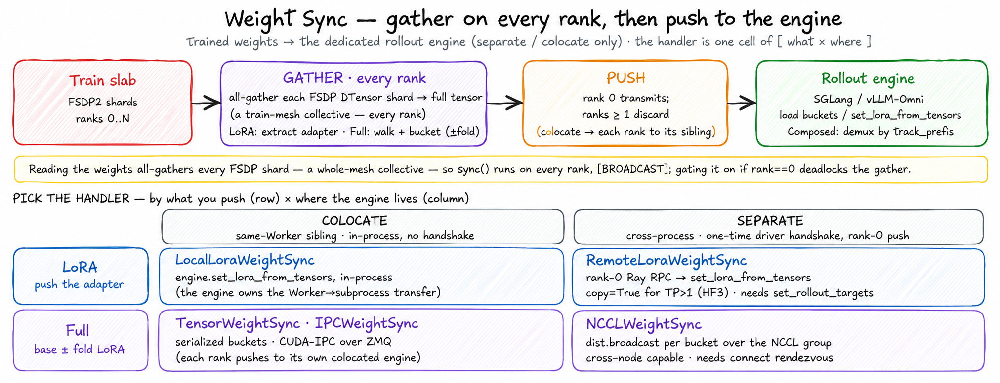

# Weight Sync

> **Where it fits:** the *sync* back-edge of the loop (dedicated modes only) —
> rollout → reward → advantage → train → **sync**. In: trained weights from the
> backend. Out: weights pushed into the rollout engine.
> Full map: [`../../README.md`](../../README.md).

  

*Every `sync()` is the same two phases — **gather** the weights (an all-gather, so it runs on **every train rank**) then **push** into the engine — and the five handlers fill a **[ what × where ]** grid: LoRA vs full × colocate vs separate.*

## What it is

`unirl.distributed.weight_sync` delivers freshly-trained weights from the train
slab into the dedicated rollout engine(s). It is the dashed back-edge of the
training loop, and it exists **only** when rollout runs on a dedicated engine
(SGLang / vLLM-Omni, in `separate` or `colocate` layouts); direct sampling (the
trainside engine) needs no sync because it samples the live training weights
in-process.

## Why it exists

The non-obvious cost: pushing weights from an FSDP model is **not** a rank-0
operation, even though only rank 0 transmits. *Reading* the weights
(`extract_lora_tensors` for LoRA, `_to_full_tensor` for full) redistributes every
FSDP `DTensor` shard to `Replicate` — a collective the whole train mesh must enter
in lockstep. So every handler runs as a `BROADCAST`-dispatched `sync()`: ranks ≥1
drive their half of the all-gather and discard, rank 0 alone transmits. That is why
this is a sibling `Remote` family and not a rank-0 helper — and why gating the push
on `if rank == 0` deadlocks the gather. The transport fan-out (LoRA vs full;
NCCL / IPC / serialized; colocate vs cross-node) then rides on that one shared
materialization.

## How it works

- **Two families, picked by `_target_`.** *LoRA* (`lora/`) extracts the trained
  adapter and loads it via the engine's `set_lora_from_tensors`. *Full-weight*
  (`full/`) materializes the full base weights (optionally with LoRA folded in) and
  streams them in buckets.
- **`sync()` is a train-mesh collective.** Extracting weights redistributes each
  FSDP `DTensor` shard to a full tensor — a collective every train rank must run —
  so `sync()` is dispatched `BROADCAST`. Only the *push* is rank-0 (for NCCL and
  Remote-LoRA); ranks ≥1 run the all-gather and discard.
- **Transports.** LoRA: `LocalLoraWeightSync` (colocate, in-process sibling) and
  `RemoteLoraWeightSync` (cross-slab rank-0 Ray push). Full: `NCCLWeightSync`
  (separate slabs, cross-node capable), `TensorWeightSync` (colocate serialized
  handoff), `IPCWeightSync` (colocate CUDA-IPC over ZMQ). Colocate handlers take the
  engine as a same-Worker sibling; separate/NCCL need a one-time driver handshake.
- **Routing.** `param_prefix` prepends the model's canonical key prefix;
  `track_prefix` further prefixes so a `ComposedRolloutEngine` can demux the update
  to one child (PE registers one handler per track).

The one bit-equality safety net is the LoRA `verify` checksum read-back — but it is
vLLM-Omni-only, so SGLang LoRA runs have none.

**Extending it:** a new transport subclasses `LoraWeightSyncBase` or
`FullWeightSync` (the FSDP→full materialization, bucketing, and `name_remap` are
already done), implements `sync()` as `BROADCAST` shipping each bucket, and adds the
matching receiver on the engine side (`../../rollout/engine/`).

## Gotchas

- **`sync()` is a train-mesh collective** — the FSDP→full materialization runs on
  *every* train rank; never gate it behind `if rank == 0`. Only the push is rank-0.
- **`transfer_queue` is not weight sync** — that's the rollout→trainer data plane
  for bulky rollout outputs (segments, conditions, decoded media); weight sync is
  trainer→rollout. Don't conflate them.
- **`param_prefix` mismatch silently corrupts the load** (wrong/zero layers) —
  `verify` is designed to catch it, but it's vLLM-Omni-only and off by default, so
  most runs have no net at all.
- **`RemoteLoraWeightSync` with `copy=False` breaks on TP>1 engines** — the zero-copy
  adapter handle carries a one-shot file descriptor consumed by the first worker, so
  the `collective_rpc` broadcast to ranks 2..N gets a dead handle (HI3). Set
  `copy=True` for any TP>1 stage; `copy=False` is only safe for a TP=1 separate slab (SD3).
- **`weight_version` is just a sender-side counter** (full handlers only), not a
  receiver idempotency key.
