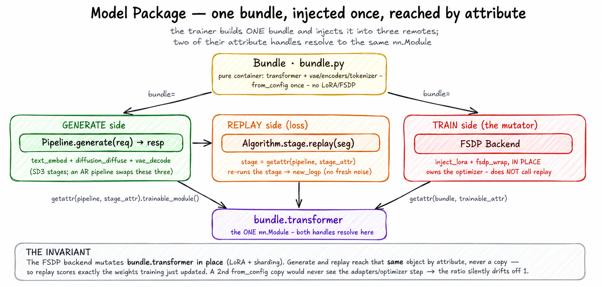

# Model Code Packages

> **Where it fits:** cross-cutting — the model code that both the *rollout* step
> (`pipeline.generate`) and the *train* step (`stage.replay`) run, on one shared set
> of weights. Full map: [`../README.md`](../README.md).

  

*The one idea that makes UniRL's RL correct: the **stage** runs the rollout forward (`diffuse` / `autoregress`) and the train forward (`replay`) over the **same** `bundle.transformer` — the one the FSDP backend mutates in place — so new_logp and old_logp land on identical, just-updated weights.*

## What it is

`unirl/models/` holds one self-contained subpackage per model (`sd3/`, `qwen3/`,
`hunyuan_image3/`, `pe/`, …). Each implements the shared **bundle / pipeline /
stage / conditions** contract so the same model code, on the same weights, serves
*both* the rollout engine (generate) and the train stack (replay).

> Not to be confused with the repository-root `models/` directory, which only holds
> local checkpoint and reward-model symlinks.

## Why it exists

Rollout and training must score the *same* weights or the GRPO ratio is
meaningless — and "same weights" is subtle, because the FSDP backend mutates
`bundle.transformer` **in place** (LoRA injection, FSDP sharding). The package is
built so both sides reach that one mutated object *by attribute* — the backend
wraps `bundle.<trainable_attr>`, the engine evals
`pipeline.<stage_attr>.trainable_module()` — instead of holding a private copy.
That is the real reason a bundle is bare modules with no lifecycle logic: a
self-loaded second copy (`from_config`) would never see the adapters or the
optimizer step, so replay would silently score stale weights and the ratio would
drift off 1.0 with no error. (The uniform contract across SD3 / Qwen3 / HunyuanImage3
is the secondary payoff — one backend drives them all by attribute name.)

## How it works

A model package bridges three concerns through one shared bundle:

- **Bundle** (`bundle.py`) — a pure container of weights + tokenizer/scheduler,
  loaded by `from_config`. No lifecycle logic. The biggest models (HunyuanImage3,
  Bagel) add a `from_meta_config` + `materialize()` path so each rank loads only its
  shard of the large transformer; SD3 / Qwen3 load eagerly.
- **Pipeline** (`pipeline.py`) — the generate entrypoint (`generate(req) -> resp`):
  it reads `req.primitives` / `sampling_params` / `sigmas`, builds the model's typed
  `Conditions`, runs the stage, and packs one or more `RolloutTrack`s.
- **Stages** (`diffusion.py` / `ar.py`) — the trainable units. `DiffusionStage`
  exposes `diffuse` (rollout), `replay` (train), and `predict_noise_at_step` (DiffusionNFT);
  `ARStage` exposes `autoregress` and `replay`. Each exposes `trainable_module()`,
  returning the `nn.Module` the FSDP backend wraps and engines eval-scope.
- **Conditions** (`conditions.py`) — typed `Batch` subclasses with
  `from_dict`/`to_dict`, so the pipeline works in typed form internally but stores
  the generic `Dict[str, Condition]` shape on the track.

The **bundle is shared, not duplicated**: the trainer builds it once and injects it
into both sides, so replay reads exactly the weights training updates — hence
pipelines offer a bundle-injected constructor alongside the self-loading
`from_config`. σ is engine-pinned: a diffusion pipeline reads `req.sigmas` verbatim
and raises if it's `None` — it doesn't compute σ at generate time. Diffusion
pipelines also implement `latent_shape()` so the trainer can author the
byte-identical `x_T` recipe.

**Extending it:** a new model is a new `unirl/models/<model>/` with
`config.py` / `bundle.py` / `diffusion.py`|`ar.py` / `conditions.py` / `pipeline.py`
mirroring an existing one — there is no registry, models are selected purely by
`_target_`. **Read `.claude/skills/development/add-model-bundle/SKILL.md` first** —
it is the authoritative bundle / pipeline / stage / conditions contract.

## Gotchas

- **`trainable_module()` is on the stage, not the bundle.** The backend reaches the
  model via `getattr(bundle, trainable_attr)`; engines via
  `getattr(pipeline, stage_attr).trainable_module()`. Keep both pointing at the same
  module.
- **Bundles must stay pure containers** — no LoRA, FSDP, autocast, or weight-sync
  logic; those are train-side lifecycle concerns.
- **Share one bundle.** For colocate/trainside runs the pipeline must be built from
  the *injected* bundle (not `from_config`), or replay reads a stale second copy of
  the weights.
- **σ is engine-pinned** — a diffusion pipeline reads `req.sigmas` and raises if
  it's `None`; never build the σ tensor inside `generate`.
- **CFG empty-negative differs per model** (SD3 `""`, Qwen-Image `" "`) — use the
  model's canonical upstream value or the rollout/replay ratio drifts off 1.0.
