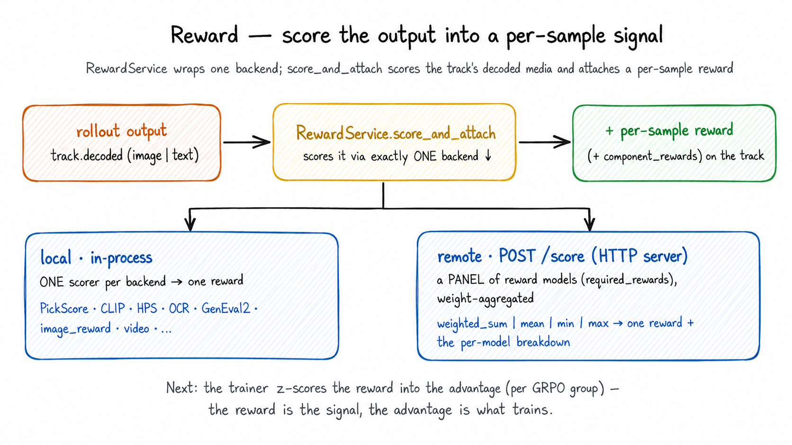

# Reward

> **Where it fits:** the *reward* step of the loop —
> rollout → **reward** → advantage → train → sync. In: the rollout engine's
> `RolloutResp`. Out: per-sample rewards (which the trainer turns into advantages).
> Full map: [`../README.md`](../README.md).

  

*One `RewardService` wraps **one backend**: a single in-process scorer (local) or a remote HTTP server that runs and weight-aggregates a **panel** of reward models. The per-sample reward it attaches is what the trainer z-scores into the advantage.*

## What it is

`unirl.reward` scores what a rollout produced — an image, a video, or text — and
writes a per-sample reward back onto the rollout track. A `RewardService` wraps
exactly **one** `RewardBackend`: either a local in-process scorer (PickScore, HPS,
CLIP, OCR, GenEval2, math, multiple-choice, video, …) or `RemoteRewardBackend`, a
thin HTTP client for the standalone server in `unirl-reward-service/`.

Turning rewards into advantages is the trainer's job
(`RolloutTrack.compute_advantages`); generating the media is the rollout engine's.

## Why it exists

RL is only as good as its reward signal, and two things about that signal are
easy to get wrong — so this module owns both:

- **One interface over many scorers.** Local or remote, image/video/text, the
  trainer always calls the same `score_and_attach(req, track)` and never touches a
  backend. Swapping PickScore for a remote multi-reward server is a recipe change,
  not a code change.
- **A bad reward must stop the step, not poison it.** A single NaN, null, or
  failed inference call would silently skew a whole GRPO group's advantages. The
  service fails loud: any non-finite or missing reward raises instead of flowing
  into training.

## How it works

Everything goes through one method, `RewardService.score_and_attach(req, track)`
(`service.py`). It runs per DP shard, so it never mutates the input track — it
returns a fresh one. Per call it:

1. **Refuses precomputed rewards** — raises if the track already has `rewards`
   (actor-side scoring is the only writer).
2. **Pairs input with output** — the prompt from `req.primitives` with the media
   in `track.decoded`. (For PE's N×M expansion it replicates each prompt to match.)
3. **Scores** — hands a typed `RewardRequest` to `backend.compute_rewards`, getting
   back rewards, per-component rewards, and per-sample success flags.
4. **Fails fast** — raises and names the sample if any failed.
5. **Zeroes runaway AR traces** — an AR generation that hit `max_new_tokens` (never
   terminated) gets reward 0, so training doesn't learn to ramble to the cap.
6. **Attaches** `rewards` + `component_rewards` and returns the track.

A backend is just `compute_rewards(request) -> RewardResponse`. Local scorers
(`local/`) subclass `LocalRewardBackend` and implement `_compute_model_rewards`;
the remote backend (`remote.py`) sends one `POST /score` per scoring call, packing
the whole batch and multiplexing every requested reward in one round trip, and
derives success from the response.

**Extending it:** a new local scorer is usually a file in `local/` subclassing
`LocalRewardBackend` (set `canonical_model_name`, implement `_load_model` +
`_compute_model_rewards`, add a `<Name>Spec`), wired in a recipe by `_target_`. A
new remote reward needs no UniRL code — add it to the server and list its name in
`RemoteRewardSpec.required_rewards`.

## Gotchas

- **A non-finite/missing reward fails the whole step, by design** — fix the scorer.
  `raise_on_failure=False` (remote only) does *not* let training continue on it: the
  backend returns zeros with `successes=[False]`, and `score_and_attach`'s fail-fast
  then raises on those flags anyway. So it can't silently zero-poison a group; leave
  it `True`.
- **`input_kind` must match the media** (`image`/`video`/`text`) — it picks which
  decoded key the backend sees. Remote allows only `image`/`video`; local scorers
  may be `text`.
- **`base_device` is ignored by the remote backend** (it's HTTP-only); local
  scorers honor it, falling back to CPU with a warning if CUDA is unavailable.
