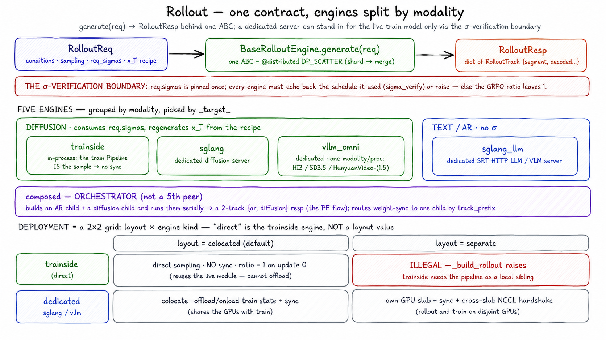

# Rollout

> **Where it fits:** the *rollout* step of the loop —
> **rollout** → reward → advantage → train → sync. In: a `RolloutReq` from the
> trainer. Out: a `RolloutResp`. Full map: [`../README.md`](../README.md).

  

*One contract — `generate(req) → RolloutResp`, dispatched `DP_SCATTER`. Five engines sit behind it (picked by `_target_`); the one you choose fixes the GPU layout and whether weight-sync runs.*

## What it is

`unirl.rollout` owns the rollout engines — the box that turns one typed
`RolloutReq` into a typed `RolloutResp` by running a model pipeline and the SDE
step kernels. It's the sampler the rest of the loop talks to through one ABC,
`BaseRolloutEngine`. It does not plan requests or compute loss.

## Why it exists

The rollout can come from two unrelated codebases — the in-process training
`Pipeline`, or the SGLang fork sampling in its own subprocess. For on-policy RL they
must walk a *numerically identical* trajectory, because the trainer replays the
rollout to recompute log-probs and any drift silently pushes the GRPO ratio off 1.0.
So this module is a **verification boundary**, not just a backend-hiding shim: it
pins one σ schedule on `req.sigmas` and makes every engine echo back exactly what it
used (`engine/sigma_verify.py`), and adapts each backend's wire format into the
canonical `RolloutResp` tracks — so a dedicated server swaps in for the training
model without the loop noticing, and a mismatch crashes loudly instead of training
on a wrong objective.

## How it works

- **One small contract.** `BaseRolloutEngine` (`engine/base.py`) is a `Remote` with
  a one-shot `__init__` (the model is loaded by the time the ctor returns),
  `wake_up`/`sleep` (no-ops by default; dedicated engines onload/offload), the
  abstract `generate(req)`, and weight-receive stubs that only the engines needing
  them override. `generate` dispatches `DP_SCATTER` — the request is sharded across
  DP workers and the per-shard resps merge into one.
- **The typed boundary** (`../types/`). `RolloutReq` carries ids, raw primitives,
  precomputed conditions, sampling params, the σ schedule (`req.sigmas` — the
  single source of truth), and the `x_T` noise recipe. `RolloutResp` is a dict of
  `RolloutTrack`s (one per modality/stage), each with a `segment` (`LatentSegment`
  for diffusion, `TextSegment` for AR), conditions for replay, decoded media, and
  lineage. Single-modality flows return one track; the composed PE flow returns two
  (`ar` + `diffusion`).
- **The engines.** `trainside` (in-process — the train actor's pipeline *is* the
  sampler), `sglang` (dedicated diffusion), `sglang_llm` (dedicated AR), `vllm_omni`
  (dedicated; HI3 / SD3 / HunyuanVideo), and `composed` (chains an AR child + a
  diffusion child for prompt enhancement). Each diffusion engine consumes
  `req.sigmas` verbatim, and the dedicated engines regenerate `x_T` from the recipe,
  so two engines start a rollout from the same noise. `forward_batch_size`
  (trainside and SGLang) bounds peak memory by slicing the req and concatenating
  the results.
- **Deployment modes:** *direct sampling* — the trainside engine, no `sync:`, the
  ratio is 1 on the first update; *separate* — a dedicated engine on its own GPUs
  plus a `sync:` block; *colocate* — a dedicated engine sharing GPUs with train,
  plus offload/onload and `sync:`.

**Extending it:** a new engine adds `engine/<name>/config.py` (a `BaseEngineConfig`
whose `make_engine(**deps)` lazily imports and builds it) and `engine/<name>/engine.py`
(subclass `BaseRolloutEngine`, `generate` dispatched `DP_SCATTER`, adapt the backend
output into `RolloutResp` tracks). A dedicated engine also implements its
weight-receive method and a matching `sync:` handler in `../distributed/weight_sync`.

## Gotchas

- **Never recompute σ inside an engine** — `req.sigmas` is the single source of
  truth; `engine/sigma_verify.py` asserts the engine echoed it back (it guards the
  GRPO log-prob ratio).
- **`generate` must dispatch `DP_SCATTER`, not `BROADCAST`** — broadcast returns a
  list of per-worker resps and breaks the trainer's single-resp consumption.
- **Direct sampling forbids a `sync:` block; dedicated requires one.** The trainside
  engine also can't live on a `layout: separate` slab — `_build_rollout` raises.
- **Reward/advantage methods are not engine code** — `compute_advantages` and
  `propagate_rewards` live on the `RolloutResp` types and are called by the trainer
  after scoring. An engine fills only `segment` / `conditions` / `decoded` / lineage;
  rewards arrive later from `RewardService`.
