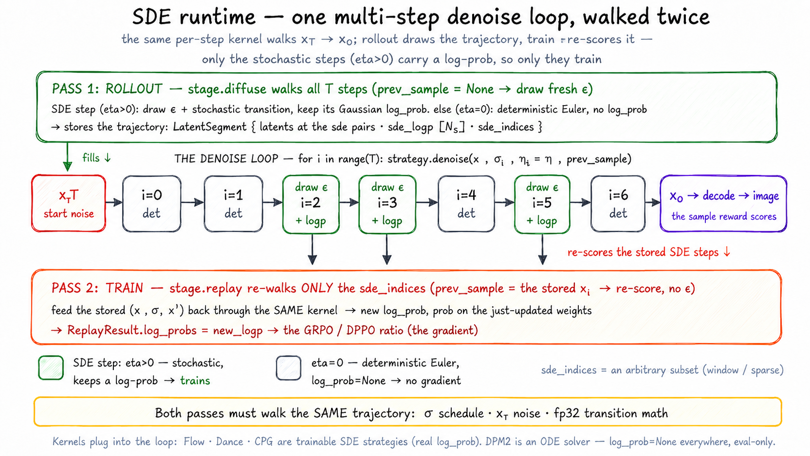

# SDE runtime

> **Where it fits:** cross-cutting — shared by the *rollout* and *train* steps,
> which replay the same kernels, σ schedule, and noise so their trajectories match.
> Full map: [`../README.md`](../README.md).

  0 SDE steps while the rest stay deterministic, and stores the trajectory; train (replay) re-walks only those SDE steps, feeding the stored transitions back through the same kernel to get new log-probs for the GRPO/FlowDPPO ratio" width="100%">

*One `strategy.denoise()` per step, under two **orthogonal** switches: **sampling** vs **replay** is the `prev_sample` argument; **stochastic** vs **deterministic** is the per-index `eta` (a step degenerates to deterministic at `eta=0` — there is no separate Euler solver).*

## What it is

`unirl.sde` owns the per-step diffusion math that sampling and training both
replay: the step **kernels** (Flow / Dance / CPS / DPM2), the FlowMatch **σ
schedule** policy (with a per-model μ override), and the deterministic
**initial-noise (`x_T`) recipe**.

## Why it exists

The policy-gradient ratio is only meaningful if rollout and train-side replay walk
the *same* trajectory. That requires three things to be bit-identical across very
different engines (trainside, SGLang, vLLM-Omni): the σ schedule, the start noise
`x_T`, and the per-step transition math. Centralizing all three here — instead of
letting each engine compute its own — is what keeps the ratio honest. Get any of
them wrong and GRPO/FlowDPPO optimize noise.

## How it works

- **One transition kernel, two modes.** Each model's diffusion stage calls
  `strategy.denoise(...)` once per step. `prev_sample=None` means *sampling* (draw
  fresh noise); passing a `prev_sample` means *replay* (score the given transition,
  no noise drawn). Sampling and replay share the exact same code — that's the
  point. The transition math runs in fp32 (σ forced to fp32 to match SGLang).
- **SDE vs deterministic is an `eta` switch, not a branch.** The denoise loop runs
  the same `step_with_logp` at every index and sets `eta>0` only on the chosen
  `sde_indices`. Those steps get a stochastic transition with a real per-step
  Gaussian log-prob (→ `LatentSegment.sde_logp`); the rest collapse to a
  deterministic Euler step with `log_prob=None` and contribute no gradient.
- **The σ schedule** comes from `FlowMatchSchedulePolicy` (`runtime.py`), loaded
  once per actor from the checkpoint JSON (no weights). Static schedules apply the
  SD3 time-shift locally (to dodge diffusers' double-shift bug #13243); dynamic
  schedules derive μ from `(H, W)` — `compute_mu` is the single per-model override
  point (FLUX.2-klein subclasses it). `ensure_req_sigmas(req, policy)` pins the
  result onto `req.sigmas` at the top of every *diffusion* engine's `generate`, so
  every backend samples on the exact schedule the trainer will replay (AR-only
  paths skip it).
- **The `x_T` recipe** (`noise.py`). The driver doesn't ship the noise tensor — it
  ships a recipe (per-sample group ids + latent shape). Each engine calls
  `regen_initial_noise(...)`, which draws on **CPU in fp32** with a per-group seeded
  generator, then casts to device. CPU randn is bit-stable across machines, so every
  engine starts each rollout from byte-identical noise.

**Extending it:** a new kernel subclasses `SDEStrategy` (or `StepStrategy` for a
deterministic ODE solver) in `kernels.py`, wired under `pipeline.strategy`. A
per-model σ override subclasses `FlowMatchSchedulePolicy` and overrides only
`compute_mu`. A new SDE-index schedule is *not* here — it's a `TimestepScheduler`
in `utils/scheduler_utils.py`, wired under `sampling.scheduler`. DanceGRPO/MixGRPO
add no kernel: DanceGRPO swaps in `DanceSDEStrategy` under `pipeline.strategy`,
MixGRPO keeps `FlowSDEStrategy` and adds a `WindowScheduler` under
`sampling.scheduler`.

## Gotchas

- **`DPM2Strategy` can't train** — it returns `log_prob=None` everywhere, so
  GRPO/FlowDPPO have no ratio. Eval-only, and stateful (needs `init_schedule`/`reset`).
- **σ silently arrives as float64** — `torch.linspace` (the static-σ branch) defaults
  to float64, so without `denoise`'s `.float()` cast the transition computes in float64
  while SGLang uses float32; the `1/(2σ²)` term amplifies the gap into the replayed
  log-prob and skews the ratio.
- **Only `x_T` is reproducible, not the per-step SDE noise** — `denoise` hard-codes
  `generator=None` into every step ("DONOT PASS GENERATOR HERE — it hurts diversity"),
  so the intermediate stochastic transitions are unseeded. That is *why* replay
  re-scores the stored `prev_sample` instead of re-drawing it.
- **`initial_latents` wins over the recipe** — a shipped latent (img2img / i2v
  first frame) is used verbatim; the recipe only fills the t2i `x_T`.
- **Don't "simplify" the static-σ branch to call diffusers** — it exists to avoid
  the double-shift bug (#13243) and is tagged `DELETE-WHEN` for when upstream is
  fixed.
